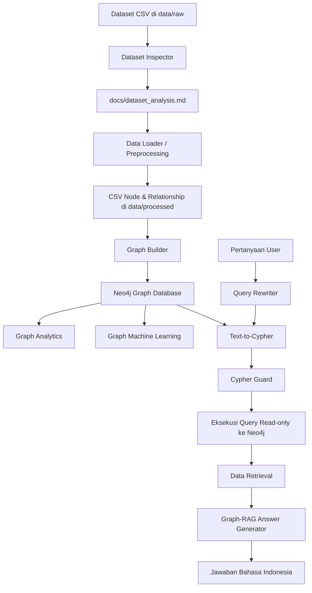

# AlumniGraph AI

AlumniGraph AI adalah project Graph-RAG berbasis Neo4j untuk melakukan eksplorasi, analisis, dan tanya-jawab terhadap data alumni. Project ini mengubah dataset CSV alumni menjadi bentuk graph, menyimpannya ke Neo4j, lalu menggunakan LLM untuk membantu proses Text-to-Cypher dan Graph-RAG.

Project ini dimulai dari **Tahap 0 - Dataset Inspection**. Tahap ini wajib selesai sebelum membuat koneksi Neo4j, query import, graph analytics, Text-to-Cypher, atau Graph-RAG.

---

## Ringkasan Project

Secara sederhana, project ini memiliki alur kerja berikut:

```text
Dataset CSV alumni
        ↓
Dataset inspection
        ↓
Preprocessing data
        ↓
Pembuatan node dan relationship CSV
        ↓
Import ke Neo4j
        ↓
Graph analytics / Graph machine learning
        ↓
Text-to-Cypher
        ↓
Graph-RAG
        ↓
Jawaban berbasis data alumni
```

Project ini bisa dijalankan melalui dua cara:

1. **Notebook `.ipynb`** untuk eksplorasi, demo, pembelajaran, dan presentasi tahap demi tahap.
2. **File Python `.py` di folder `src/`** untuk eksekusi yang lebih terstruktur melalui terminal.

Notebook dan file `.py` bukan dua project terpisah. Notebook berfungsi sebagai alur interaktif, sedangkan file `.py` adalah kode inti yang menjalankan proses utama.

---

## Tujuan Tahap 0

- Mengambil dataset dari repository sumber.
- Menyimpan file CSV mentah ke `data/raw`.
- Membaca seluruh CSV tanpa mengasumsikan nama kolom.
- Menampilkan nama file, jumlah baris, jumlah kolom, daftar kolom, missing value, duplikasi, dan contoh 5 baris pertama.
- Membuat laporan inspeksi di `docs/dataset_analysis.md`.
- Memberi rekomendasi awal schema graph berdasarkan kolom yang benar-benar ditemukan.

---

## Fitur Utama

- Inspeksi dataset CSV secara otomatis.
- Preprocessing data alumni menjadi file node dan relationship.
- Import graph ke Neo4j.
- Penyusunan schema graph alumni.
- Query Cypher untuk membaca hubungan antar node.
- Graph analytics menggunakan Neo4j Graph Data Science.
- Graph machine learning untuk clustering, embedding, dan similarity alumni.
- Text-to-Cypher untuk mengubah pertanyaan bahasa Indonesia menjadi query Cypher.
- Graph-RAG untuk menghasilkan jawaban berbasis hasil retrieval dari Neo4j.
- CLI chat dengan tiga mode: `llm`, `cypher`, dan `rag`.

---

## Arsitektur Project



### Komponen Arsitektur

| Komponen | File / Folder | Fungsi |
|---|---|---|
| Dataset mentah | `data/raw/` | Tempat menyimpan CSV asli dari repository sumber. |
| Dataset inspection | `src/dataset_inspector.py` | Mengecek struktur CSV, missing value, duplikasi, dan membuat laporan dataset. |
| Preprocessing | `src/data_loader.py` | Membersihkan data dan membuat file node serta relationship. |
| Graph import | `src/graph_builder.py` | Membuat constraint dan mengimpor data ke Neo4j. |
| Koneksi database | `src/database.py` | Mengatur koneksi dan query ke Neo4j. |
| Konfigurasi | `src/config.py` dan `.env` | Mengatur path, Neo4j, dan OpenRouter. |
| Text-to-Cypher | `src/text_to_cypher.py` | Mengubah pertanyaan pengguna menjadi query Cypher. |
| Cypher guard | `src/cypher_guard.py` | Memvalidasi query agar hanya read-only dan aman dijalankan. |
| Graph-RAG | `src/graph_rag.py` | Menggabungkan query, retrieval Neo4j, dan LLM untuk jawaban akhir. |
| Chat CLI | `src/chat_cli.py` | Menjalankan chat mode `llm`, `cypher`, atau `rag`. |
| Notebook | `notebooks/` | Alur interaktif untuk menjalankan tahap project satu per satu. |
| Dokumentasi | `docs/` | Menyimpan hasil analisis, schema, evaluasi, dan catatan penggunaan AI. |

---

## Struktur Folder

```text
graph-llm/
|-- README.md
|-- requirements.txt
|-- .env.example
|-- .gitignore
|-- docker-compose.yml
|-- data/
|   |-- raw/
|   |-- processed/
|   `-- biographies/
|-- notebooks/
|   |-- 00_dataset_inspection.ipynb
|   |-- 01_database_connection.ipynb
|   |-- 02_data_preprocessing.ipynb
|   |-- 03_import_to_neo4j.ipynb
|   |-- 04_llm_graph_builder.ipynb
|   |-- 05_graph_analytics.ipynb
|   |-- 06_graph_machine_learning.ipynb
|   |-- 07_text_to_cypher.ipynb
|   `-- 08_graph_rag_demo.ipynb
|-- src/
|   |-- __init__.py
|   |-- answer_formatter.py
|   |-- cache_manager.py
|   |-- chat_cli.py
|   |-- config.py
|   |-- conversation_manager.py
|   |-- cypher_guard.py
|   |-- database.py
|   |-- data_loader.py
|   |-- dataset_inspector.py
|   |-- entity_resolver.py
|   |-- graph_analytics.py
|   |-- graph_builder.py
|   |-- graph_ml.py
|   |-- graph_rag.py
|   |-- llm_client.py
|   |-- logger.py
|   |-- query_rewriter.py
|   `-- text_to_cypher.py
`-- docs/
    |-- ai_usage.md
    |-- architecture.md
    |-- chat_usage.md
    |-- dataset_analysis.md
    |-- evaluation.md
    |-- graph_schema.md
    `-- video_script.md
```

Catatan: jika folder hasil clone bernama `alumni-graph-ai`, jalankan semua command dari folder tersebut. Nama folder root boleh berbeda, yang penting command dijalankan dari root project yang memiliki `README.md`, `requirements.txt`, `src/`, dan `docker-compose.yml`.

---

## Prasyarat

Sebelum menjalankan project, pastikan sudah tersedia:

- Python 3.10 atau lebih baru.
- Git.
- Docker dan Docker Compose.
- Neo4j dijalankan melalui `docker-compose.yml`.
- OpenRouter API Key jika ingin menjalankan fitur LLM, Text-to-Cypher, atau Graph-RAG.
- Jupyter Notebook jika ingin menjalankan alur `.ipynb`.

Dependency utama project terdapat di `requirements.txt`, antara lain:

- `pandas`
- `jupyter`
- `ipykernel`
- `python-dotenv`
- `neo4j`
- `rapidfuzz`
- `requests`
- `numpy`
- `scikit-learn`

---

## Instalasi

### 1. Clone repository

```powershell
git clone https://github.com/bimorajendraa/graph-llm.git
cd graph-llm
```

### 2. Buat virtual environment

```powershell
python -m venv .venv
.\.venv\Scripts\Activate.ps1
```

Untuk macOS atau Linux:

```bash
python -m venv .venv
source .venv/bin/activate
```

### 3. Install dependency

```powershell
pip install -r requirements.txt
```

### 4. Siapkan file environment

```powershell
copy .env.example .env
```

Untuk macOS atau Linux:

```bash
cp .env.example .env
```

---

## Konfigurasi

File `.env.example` berisi konfigurasi awal seperti berikut:

```env
NEO4J_URI=bolt://localhost:7687
NEO4J_USERNAME=neo4j
NEO4J_PASSWORD=change-this-password
NEO4J_DATABASE=neo4j
OPENROUTER_API_KEY=
OPENROUTER_MODEL=nex-agi/nex-n2-pro:free
```

Isi file `.env` sesuai kebutuhan:

```env
NEO4J_URI=bolt://localhost:7687
NEO4J_USERNAME=neo4j
NEO4J_PASSWORD=change-this-password
NEO4J_DATABASE=neo4j
OPENROUTER_API_KEY=isi_api_key_openrouter_di_sini
OPENROUTER_MODEL=nex-agi/nex-n2-pro:free
```

Keterangan:

| Variabel | Fungsi |
|---|---|
| `NEO4J_URI` | Alamat koneksi Bolt Neo4j. |
| `NEO4J_USERNAME` | Username Neo4j. |
| `NEO4J_PASSWORD` | Password Neo4j. Harus sama dengan konfigurasi di `docker-compose.yml`. |
| `NEO4J_DATABASE` | Nama database Neo4j. Default: `neo4j`. |
| `OPENROUTER_API_KEY` | API key untuk menjalankan LLM. |
| `OPENROUTER_MODEL` | Model LLM yang digunakan melalui OpenRouter. |

Pada `docker-compose.yml`, Neo4j dijalankan dengan password default:

```text
neo4j/change-this-password
```

Artinya, nilai `NEO4J_PASSWORD` di `.env` harus tetap:

```env
NEO4J_PASSWORD=change-this-password
```

Jika password di `docker-compose.yml` diubah, maka `.env` juga harus ikut diubah.

---

## Cara Mengambil Dataset

Jalankan dari folder root project.

```powershell
git clone https://github.com/burhansa25/graph.git data/source_repo
Get-ChildItem .\data\source_repo -Recurse -Filter *.csv | Copy-Item -Destination .\data\raw
```

Jika ada file CSV dengan nama sama di subfolder berbeda, salin secara manual agar nama file tidak tertimpa.

Untuk macOS atau Linux:

```bash
git clone https://github.com/burhansa25/graph.git data/source_repo
find data/source_repo -name "*.csv" -exec cp {} data/raw/ \;
```

---

## Cara Run Project dengan File `.py`

Project dapat dijalankan tanpa notebook. Jalur utama eksekusi berada di folder `src/`.

### 1. Menjalankan inspeksi dataset

```powershell
python -m src.dataset_inspector --data-dir data/raw --output docs/dataset_analysis.md
```

Output laporan akan tersimpan di:

```text
docs/dataset_analysis.md
```

Tahap ini membaca seluruh CSV di `data/raw`, menampilkan struktur data, missing value, duplikasi, contoh data, dan rekomendasi awal schema graph.

---

### 2. Menjalankan preprocessing

Setelah laporan dataset selesai dibuat dan mapping kolom sudah sesuai, jalankan:

```powershell
python -m src.data_loader --raw-dir data/raw --output-dir data/processed
```

Script ini membuat CSV node dan relationship di `data/processed` berdasarkan kolom aktual:

- `alumniLabel`
- `univLabel`
- `occupationLabel`
- `employerLabel`
- `positionLabel`
- `wiki`

Output preprocessing meliputi:

```text
data/processed/clean_rows.csv
data/processed/alumni.csv
data/processed/universities.csv
data/processed/occupations.csv
data/processed/employers.csv
data/processed/positions.csv
data/processed/rel_alumni_university.csv
data/processed/rel_alumni_occupation.csv
data/processed/rel_alumni_employer.csv
data/processed/rel_alumni_position.csv
```

---

### 3. Menjalankan Neo4j

```powershell
docker compose up -d
```

Neo4j Browser dapat dibuka melalui:

```text
http://localhost:7474
```

Koneksi Bolt untuk Python menggunakan:

```text
bolt://localhost:7687
```

---

### 4. Import graph ke Neo4j

```powershell
python -m src.graph_builder --processed-dir data/processed
```

Tahap ini akan:

- Membuat constraint Neo4j.
- Mengimpor node `Alumni`, `University`, `Occupation`, `Employer`, dan `Position`.
- Mengimpor relationship antar node.
- Menghitung jumlah node yang sudah masuk ke graph.

---

### 5. Menjalankan chat LLM biasa

Mode ini tidak menggunakan data Neo4j. Mode ini hanya menjalankan chat LLM biasa.

```powershell
python -m src.chat_cli --mode llm
```

---

### 6. Menjalankan mode Text-to-Cypher

Mode ini mengubah pertanyaan bahasa Indonesia menjadi query Cypher dan menampilkan hasil retrieval dari Neo4j.

```powershell
python -m src.chat_cli --mode cypher
```

Contoh pertanyaan:

```text
Berapa banyak alumni dari ITB?
```

Contoh query yang dapat dihasilkan:

```cypher
MATCH (a:Alumni)-[:LULUSAN_DARI]->(u:University {normalizedName: toLower('Institut Teknologi Bandung')})
RETURN count(a) AS jumlah LIMIT 25
```

---

### 7. Menjalankan mode Graph-RAG

Mode ini menjalankan pipeline lengkap: pertanyaan user, query rewriting, Text-to-Cypher, retrieval Neo4j, dan jawaban akhir dari LLM.

```powershell
python -m src.chat_cli --mode rag
```

Jika tidak ingin menampilkan data retrieval mentah, gunakan:

```powershell
python -m src.chat_cli --mode rag --hide-rows
```

---

## Ringkasan File Eksekusi `.py`

| File | Bisa dijalankan langsung? | Command | Fungsi |
|---|---:|---|---|
| `src/dataset_inspector.py` | Ya | `python -m src.dataset_inspector` | Inspeksi dataset dan membuat laporan Markdown. |
| `src/data_loader.py` | Ya | `python -m src.data_loader` | Preprocessing dataset menjadi node dan relationship CSV. |
| `src/graph_builder.py` | Ya | `python -m src.graph_builder` | Import data hasil preprocessing ke Neo4j. |
| `src/chat_cli.py` | Ya | `python -m src.chat_cli --mode rag` | CLI chat untuk mode `llm`, `cypher`, dan `rag`. |
| `src/graph_analytics.py` | Tidak langsung sebagai CLI | Diakses dari notebook atau import class | Query analitik graph seperti top connected alumni dan PageRank. |
| `src/graph_ml.py` | Tidak langsung sebagai CLI | Diakses dari notebook atau import class | Louvain clustering, FastRP embedding, dan KNN similarity. |
| `src/text_to_cypher.py` | Modul pendukung | Dipakai oleh `chat_cli.py` dan `graph_rag.py` | Mengubah pertanyaan menjadi Cypher. |
| `src/graph_rag.py` | Modul pendukung | Dipakai oleh `chat_cli.py` | Menjalankan pipeline Graph-RAG. |

---

## Cara Run dengan Notebook `.ipynb`

Notebook tersedia di folder:

```text
notebooks/
```

Jalankan Jupyter:

```powershell
jupyter notebook
```

Lalu buka notebook sesuai urutan berikut:

1. `00_dataset_inspection.ipynb`
2. `01_database_connection.ipynb`
3. `02_data_preprocessing.ipynb`
4. `03_import_to_neo4j.ipynb`
5. `04_llm_graph_builder.ipynb`
6. `05_graph_analytics.ipynb`
7. `06_graph_machine_learning.ipynb`
8. `07_text_to_cypher.ipynb`
9. `08_graph_rag_demo.ipynb`

Notebook digunakan untuk menjalankan proses secara interaktif. Cocok untuk debugging, eksplorasi, dan presentasi karena setiap tahap dapat dilihat output-nya langsung.

---

## Apakah Harus Menggunakan `.ipynb`?

Tidak harus.

Project ini tetap bisa dijalankan tanpa `.ipynb` karena file utama di folder `src/` sudah dapat dieksekusi melalui terminal. Notebook hanya berperan sebagai versi interaktif dari pipeline.

Perbandingannya:

| Aspek | Notebook `.ipynb` | Python `.py` |
|---|---|---|
| Tujuan | Eksplorasi, demo, presentasi | Eksekusi utama dan reusable code |
| Cara run | Jupyter Notebook | Terminal / command line |
| Cocok untuk | Melihat output per tahap | Menjalankan pipeline secara rapi |
| Wajib? | Tidak | Ya, sebagai logic inti project |
| Contoh | `08_graph_rag_demo.ipynb` | `python -m src.chat_cli --mode rag` |

Kesimpulannya, notebook dan file Python tidak berdiri sebagai dua sistem yang berbeda. File `.py` adalah logic utama, sedangkan notebook memanggil atau mendemonstrasikan logic tersebut secara bertahap.

---

## Schema Graph

Schema graph utama yang digunakan:

### Node

```text
Alumni(alumniId, name, normalizedName, description, source, clusterId, embedding)
University(name, normalizedName, source)
Occupation(name, normalizedName, source)
Employer(name, normalizedName, source)
Position(name, normalizedName, source)
```

### Relationship

```text
(:Alumni)-[:LULUSAN_DARI]->(:University)
(:Alumni)-[:BEKERJA_SEBAGAI]->(:Occupation)
(:Alumni)-[:BEKERJA_DI]->(:Employer)
(:Alumni)-[:MENJABAT_SEBAGAI]->(:Position)
(:Alumni)-[:MIRIP_DENGAN]->(:Alumni)
```

Relationship `MIRIP_DENGAN` tidak berasal langsung dari CSV mentah. Relationship ini dibuat pada tahap graph machine learning, misalnya setelah embedding dan KNN similarity dijalankan.

---

## Penjelasan Singkat Logika Cypher

Cypher adalah bahasa query untuk Neo4j. Pada project ini, Cypher digunakan untuk membaca hubungan antar node alumni.

Contoh sederhana:

```cypher
MATCH (a:Alumni)-[:LULUSAN_DARI]->(u:University)
RETURN a.name, u.name
LIMIT 25
```

Artinya:

- Cari node `Alumni`.
- Ikuti relationship `LULUSAN_DARI` menuju node `University`.
- Tampilkan nama alumni dan nama universitas.
- Batasi hasil maksimal 25 baris.

Contoh menghitung alumni dari satu universitas:

```cypher
MATCH (a:Alumni)-[:LULUSAN_DARI]->(u:University {normalizedName: toLower('Institut Teknologi Bandung')})
RETURN count(a) AS jumlah
LIMIT 25
```

Artinya:

- Cari alumni yang memiliki hubungan `LULUSAN_DARI` ke ITB.
- Hitung jumlah alumni.
- Tampilkan hasil sebagai kolom `jumlah`.

Contoh mencari alumni berdasarkan pekerjaan:

```cypher
MATCH (a:Alumni)-[:BEKERJA_SEBAGAI]->(o:Occupation)
WHERE toLower(o.name) CONTAINS toLower('politikus')
RETURN a.name, o.name
LIMIT 25
```

Pada project ini, query Cypher yang dihasilkan LLM divalidasi oleh `src/cypher_guard.py`. Tujuannya agar query yang dijalankan tetap aman dan bersifat read-only.

Aturan keamanan utama:

- Query harus berupa query baca seperti `MATCH`, `WITH`, `RETURN`, `CALL DB.`, atau `CALL GDS.`.
- Query wajib memiliki `RETURN`.
- Query dibatasi dengan `LIMIT 25` jika belum memiliki limit.
- Query tidak boleh mengandung keyword tulis seperti `CREATE`, `MERGE`, `DELETE`, `SET`, `REMOVE`, `DROP`, `LOAD`, `CALL DBMS`, atau `CALL APOC`.

---

## Penjelasan Singkat Pipeline AI

Pipeline AI pada project ini digunakan untuk menghubungkan bahasa natural pengguna dengan data graph di Neo4j.

### 1. User mengajukan pertanyaan

Contoh:

```text
Berapa banyak alumni dari ITB dan siapa saja namanya?
```

### 2. Query rewriter memproses pertanyaan

Jika pertanyaan adalah follow-up, sistem mencoba memperjelas pertanyaan berdasarkan konteks percakapan sebelumnya.

Contoh:

```text
Kalau dari universitas lain?
```

Pertanyaan seperti ini membutuhkan konteks dari pertanyaan sebelumnya agar bisa dipahami.

### 3. Text-to-Cypher membuat query

`src/text_to_cypher.py` mengirim prompt berisi schema graph ke LLM. LLM diminta menghasilkan query Cypher saja, tanpa penjelasan tambahan.

Contoh output:

```cypher
MATCH (a:Alumni)-[:LULUSAN_DARI]->(u:University {normalizedName: toLower('Institut Teknologi Bandung')})
RETURN count(a) AS total LIMIT 25
---
MATCH (a:Alumni)-[:LULUSAN_DARI]->(u:University {normalizedName: toLower('Institut Teknologi Bandung')})
RETURN a.name LIMIT 25
```

Jika pertanyaan membutuhkan lebih dari satu query, query dipisahkan dengan tanda:

```text
---
```

### 4. Cypher guard memvalidasi query

Sebelum query dijalankan, `src/cypher_guard.py` memastikan query aman dan hanya membaca data.

### 5. Query dijalankan ke Neo4j

Query yang lolos validasi dikirim ke Neo4j melalui `src/database.py`. Hasilnya berupa baris data retrieval.

### 6. Graph-RAG membuat jawaban akhir

`src/graph_rag.py` mengirim pertanyaan user, query Cypher, dan hasil retrieval ke LLM. LLM kemudian menyusun jawaban akhir dalam bahasa Indonesia berdasarkan data yang ditemukan.

### 7. Jawaban diberikan ke user

Jawaban akhir harus berbasis data retrieval. Jika data tidak cukup, sistem harus menyampaikan keterbatasannya dan tidak mengarang informasi di luar data.

---

## Mode Chat CLI

`src/chat_cli.py` menyediakan tiga mode:

### 1. Mode `llm`

```powershell
python -m src.chat_cli --mode llm
```

Mode ini hanya menjalankan chat LLM biasa. Tidak mengambil data dari Neo4j.

### 2. Mode `cypher`

```powershell
python -m src.chat_cli --mode cypher
```

Mode ini menampilkan query Cypher dan data retrieval dari Neo4j. Cocok untuk debugging apakah pertanyaan sudah diterjemahkan menjadi query yang benar.

### 3. Mode `rag`

```powershell
python -m src.chat_cli --mode rag
```

Mode ini menjalankan Graph-RAG penuh. Sistem membuat query, mengambil data dari Neo4j, lalu menyusun jawaban akhir.

Untuk keluar dari chat, ketik salah satu:

```text
exit
quit
keluar
q
```

---

## Graph Analytics dan Graph Machine Learning

Project ini juga menyiapkan tahap analisis graph dan machine learning.

### Graph Analytics

File:

```text
src/graph_analytics.py
```

Contoh fungsi:

- `top_connected_alumni()` untuk melihat alumni dengan koneksi terbanyak.
- `university_alumni_counts()` untuk menghitung jumlah alumni per universitas.
- `occupation_counts()` untuk menghitung jumlah alumni per pekerjaan.
- `create_gds_projection()` untuk membuat proyeksi graph di Neo4j GDS.
- `page_rank()` untuk menghitung ranking node alumni.

### Graph Machine Learning

File:

```text
src/graph_ml.py
```

Contoh fungsi:

- `write_louvain_clusters()` untuk membuat cluster komunitas alumni.
- `write_fast_rp_embeddings()` untuk membuat embedding node.
- `write_knn_similarity()` untuk membuat relationship `MIRIP_DENGAN` antar alumni.
- `similar_alumni()` untuk mencari alumni yang mirip berdasarkan hasil similarity.

Tahap ini biasanya dijalankan melalui notebook:

```text
notebooks/05_graph_analytics.ipynb
notebooks/06_graph_machine_learning.ipynb
```

---

## Urutan Pipeline yang Direkomendasikan

Jalankan project dengan urutan berikut:

```powershell
# 1. Aktifkan virtual environment
.\.venv\Scripts\Activate.ps1

# 2. Ambil dataset dan simpan CSV ke data/raw
# Lihat bagian Cara Mengambil Dataset

# 3. Inspeksi dataset
python -m src.dataset_inspector --data-dir data/raw --output docs/dataset_analysis.md

# 4. Preprocessing dataset
python -m src.data_loader --raw-dir data/raw --output-dir data/processed

# 5. Jalankan Neo4j
docker compose up -d

# 6. Import graph ke Neo4j
python -m src.graph_builder --processed-dir data/processed

# 7. Jalankan Graph-RAG
python -m src.chat_cli --mode rag
```

---

## Troubleshooting

### 1. Neo4j tidak bisa terkoneksi

Pastikan Docker sudah berjalan:

```powershell
docker compose ps
```

Pastikan container Neo4j aktif, lalu cek browser:

```text
http://localhost:7474
```

Pastikan `.env` sesuai dengan `docker-compose.yml`.

---

### 2. Error password Neo4j

Jika password di Docker berbeda dari `.env`, koneksi akan gagal. Samakan nilai berikut:

```env
NEO4J_PASSWORD=change-this-password
```

Dengan konfigurasi Docker:

```yaml
NEO4J_AUTH: neo4j/change-this-password
```

---

### 3. Error OpenRouter API Key

Jika mode `llm`, `cypher`, atau `rag` gagal karena API key, isi:

```env
OPENROUTER_API_KEY=isi_api_key_openrouter_di_sini
```

Mode `dataset_inspector`, `data_loader`, dan `graph_builder` tidak membutuhkan OpenRouter API Key.

---

### 4. Data retrieval kosong

Kemungkinan penyebab:

- Dataset belum masuk ke `data/raw`.
- Preprocessing belum dijalankan.
- Graph belum diimport ke Neo4j.
- Pertanyaan user tidak sesuai dengan data yang ada.
- Alias atau nama universitas tidak cocok dengan `normalizedName` di graph.

Cek ulang urutan:

```powershell
python -m src.dataset_inspector --data-dir data/raw --output docs/dataset_analysis.md
python -m src.data_loader --raw-dir data/raw --output-dir data/processed
docker compose up -d
python -m src.graph_builder --processed-dir data/processed
python -m src.chat_cli --mode cypher
```

---

## Catatan Penting

Jangan membuat properti graph seperti `alumniId`, `alumniLabel`, `univLabel`, `occupationLabel`, `employerLabel`, `positionLabel`, `description`, atau `source` sebelum kolom tersebut benar-benar ditemukan atau dipetakan dari dataset aktual.

Tahap berikutnya baru boleh dibuat setelah `docs/dataset_analysis.md`
menjelaskan struktur dataset dan mapping kolom ke schema target.

## Troubleshooting

### Jawaban selalu kosong / "Data retrieval tidak ada hasil"

Penyebab paling umum: database Neo4j kosong, biasanya setelah container
atau volume Docker direset (mis. `docker compose down -v`, container baru,
atau pertama kali setup). Tanda di log: warning seperti
`label does not exist: Alumni` atau `relationship type does not exist:
LULUSAN_DARI`.

**Solusi**, jalankan ulang import setelah Neo4j aktif:

```powershell
docker compose up -d
python -m src.graph_builder --processed-dir data/processed
```

Mode `--mode rag` sekarang otomatis memberi peringatan di awal sesi chat
jika node `Alumni` masih nol, jadi masalah ini akan terlihat segera tanpa
perlu menunggu jawaban kosong berulang kali.

### `Error Graph-RAG: 'choices'`

Ini terjadi saat OpenRouter mengembalikan HTTP 200 tapi body response
berisi `{"error": {...}}` alih-alih `{"choices": [...]}`, biasanya saat
provider upstream model gratis sedang overload. `src/llm_client.py` sudah
menangani kondisi ini secara eksplisit dan akan menampilkan pesan error
yang jelas, bukan crash. Coba ulangi pertanyaan, atau ganti
`OPENROUTER_MODEL` di `.env`.

### `Error: Query harus memiliki RETURN clause.`

Terjadi saat LLM tidak mengembalikan Cypher yang valid, biasanya untuk
pertanyaan chit-chat atau di luar scope data alumni (mis. "Apa yang bisa
kita lakukan di sini?"). `GraphRAG.answer()` sekarang menangani kondisi
ini secara otomatis dan memberi jawaban yang membantu daripada
menampilkan error mentah.

### `429 Rate limit exceeded: free-models-per-day`

Kuota harian model gratis OpenRouter sudah habis (umumnya terbatas dan
diprioritaskan lebih rendah dibanding request berbayar). Solusi:

- Tunggu reset kuota harian, atau
- Tambahkan kredit di akun OpenRouter dan ganti `OPENROUTER_MODEL` ke
  model berbayar (lihat harga terkini di openrouter.ai/models), atau
- Aktifkan cache LLM (`LLM_CACHE_ENABLED=true`, default aktif) supaya
  pertanyaan yang identik tidak memanggil API lagi.

### Respons terasa lambat

Setiap pertanyaan di `--mode rag` bisa memicu hingga 3 pemanggilan LLM
berurutan: rewrite pertanyaan follow-up, generate Cypher, dan generate
jawaban akhir. Beberapa hal yang membantu:

- Cache LLM aktif secara default (`src/cache_manager.py` via
  `src/llm_client.py`) sehingga pertanyaan yang identik tidak memanggil
  API lagi.
- `src/query_rewriter.py` sekarang skip pemanggilan LLM untuk pertanyaan
  yang terlihat berdiri sendiri (bukan follow-up vague seperti
  "Lainnya?" atau "Kalau dari UGM?").
- Model gratis (`:free`) cenderung lebih lambat karena prioritas
  routing lebih rendah dibanding model berbayar.