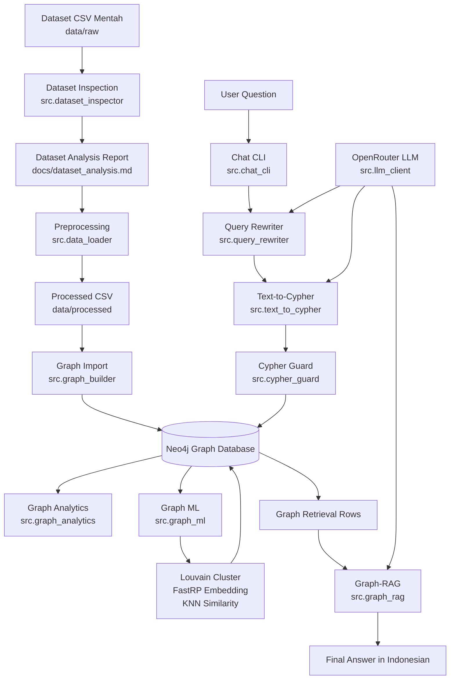

# AlumniGraph AI

AlumniGraph AI adalah proyek berbasis **Python, Neo4j, Cypher, Graph Data Science, dan LLM** untuk membangun graph alumni dari dataset CSV, menjalankan analisis graph, melakukan graph machine learning, serta menyediakan fitur tanya jawab berbasis **Text-to-Cypher** dan **Graph-RAG**.

Proyek ini dimulai dari **Tahap 0 - Dataset Inspection**. Tahap ini wajib selesai sebelum membuat koneksi Neo4j, query import, graph analytics, Text-to-Cypher, atau Graph-RAG agar struktur data yang digunakan benar-benar sesuai dengan kolom aktual pada dataset.

---

## Tujuan Proyek

Tujuan utama proyek ini adalah membuat pipeline end-to-end untuk:

1. Mengambil dan menyimpan dataset alumni dalam format CSV.
2. Melakukan inspeksi awal dataset tanpa mengasumsikan nama kolom secara sembarangan.
3. Membersihkan dataset dan mengubahnya menjadi file node serta relationship.
4. Mengimpor data hasil preprocessing ke Neo4j.
5. Membentuk graph alumni dengan node seperti `Alumni`, `University`, `Occupation`, `Employer`, dan `Position`.
6. Menjalankan analisis graph dan graph machine learning.
7. Menggunakan LLM untuk:
   - chat umum,
   - mengubah pertanyaan bahasa natural menjadi Cypher,
   - mengambil data dari Neo4j,
   - menyusun jawaban akhir berbasis Graph-RAG.

---

## Fitur Utama

### 1. Dataset Inspection

Tahap ini dilakukan oleh `src/dataset_inspector.py`.

Fungsinya:

- Mengambil dataset dari repository sumber.
- Menyimpan file CSV mentah ke `data/raw`.
- Membaca seluruh CSV tanpa mengasumsikan nama kolom.
- Menampilkan nama file, jumlah baris, jumlah kolom, daftar kolom, missing value, duplikasi, tipe data, dan contoh 5 baris pertama.
- Membuat laporan inspeksi di `docs/dataset_analysis.md`.
- Memberi rekomendasi awal schema graph berdasarkan kolom yang benar-benar ditemukan.

### 2. Data Preprocessing

Tahap ini dilakukan oleh `src/data_loader.py`.

Fungsinya:

- Mendeteksi dataset utama dari folder `data/raw`.
- Membersihkan teks, spasi, nilai kosong, dan duplikasi.
- Menggunakan kolom wajib:
  - `univLabel`
  - `alumniLabel`
- Menggunakan kolom opsional jika tersedia:
  - `occupationLabel`
  - `employerLabel`
  - `positionLabel`
  - `wiki`
- Membuat `alumniId` stabil berbasis hash dari nama alumni dan universitas.
- Menghasilkan CSV node dan relationship di `data/processed`.

Output preprocessing:

```text
data/processed/
|-- clean_rows.csv
|-- alumni.csv
|-- universities.csv
|-- occupations.csv
|-- employers.csv
|-- positions.csv
|-- rel_alumni_university.csv
|-- rel_alumni_occupation.csv
|-- rel_alumni_employer.csv
`-- rel_alumni_position.csv
```

### 3. Import Graph ke Neo4j

Tahap ini dilakukan oleh `src/graph_builder.py`.

Fungsinya:

- Membuat constraint agar node penting tidak duplikat.
- Mengimpor node dari CSV hasil preprocessing.
- Mengimpor relationship antar-node.
- Menggunakan `MERGE` agar import dapat dijalankan ulang tanpa membuat data ganda.
- Mendukung ekstraksi entitas dari teks biodata alumni menggunakan LLM.

### 4. Graph Analytics

Tahap ini dilakukan oleh `src/graph_analytics.py`.

Fungsinya:

- Melihat alumni dengan koneksi terbanyak.
- Menghitung jumlah alumni per universitas.
- Menghitung jumlah alumni per pekerjaan.
- Membuat projection graph untuk Neo4j Graph Data Science.

### 5. Graph Machine Learning

Tahap ini dilakukan oleh `src/graph_ml.py`.

Graph ML di proyek ini bukan supervised learning untuk prediksi label seperti klasifikasi biasa. Graph ML digunakan untuk membaca pola koneksi antar-node di graph.

Fungsinya:

- **Louvain Community Detection** untuk menemukan komunitas atau cluster alumni berdasarkan koneksi graph. Hasilnya ditulis ke properti `clusterId`.
- **FastRP Embedding** untuk membuat representasi vektor dari node graph. Hasilnya ditulis ke properti `embedding`.
- **KNN Similarity** untuk mencari alumni yang mirip berdasarkan embedding graph. Hasilnya ditulis sebagai relationship `MIRIP_DENGAN` dengan properti `score`.

Dengan kata lain, bagian ML dipakai agar sistem tidak hanya menyimpan data, tetapi juga bisa menemukan pola komunitas dan kemiripan antar-alumni.

### Auto Graph ML pada mode RAG/Cypher

Tahap ini dibantu oleh `src/graph_ml_orchestrator.py`.

Saat user bertanya di mode `rag` atau `cypher` tentang kemiripan, rekomendasi,
cluster, komunitas, similarity, atau alumni yang paling berpengaruh, sistem
otomatis mengecek apakah hasil Graph ML sudah tersedia di Neo4j:

- property `embedding` pada sebagian node `Alumni`,
- property `clusterId` pada sebagian node `Alumni`,
- relationship `MIRIP_DENGAN` antar alumni.

Jika belum tersedia atau belum lengkap, Python orchestration akan menjalankan
pipeline Graph ML:

1. Membuat ulang GDS projection dengan `GraphAnalytics.create_gds_projection()`.
2. Menjalankan Louvain untuk menulis `clusterId`.
3. Menjalankan FastRP untuk menulis `embedding`.
4. Menjalankan KNN untuk membuat relationship `MIRIP_DENGAN`.

Query write seperti `CALL gds.knn.write`, `CALL gds.*.mutate`, dan
`CALL gds.graph.drop` tidak boleh dibuat oleh LLM. Query seperti itu hanya
dijalankan dari Python orchestrator. Text-to-Cypher tetap read-only.

### 6. Text-to-Cypher

Tahap ini dilakukan oleh `src/text_to_cypher.py` dan diamankan oleh `src/cypher_guard.py`.

Fungsinya:

- Mengubah pertanyaan bahasa Indonesia menjadi query Cypher.
- Menyediakan schema graph ke LLM agar query yang dibuat sesuai struktur Neo4j.
- Mengubah alias universitas seperti `ITB`, `ITS`, `UGM`, `UI`, `UNPAD`, dan lainnya menjadi nama lengkap.
- Mendukung beberapa query sekaligus dengan pemisah `---`.
- Memastikan query bersifat read-only.
- Menolak query berbahaya seperti `CREATE`, `MERGE`, `DELETE`, `DROP`, `SET`, `REMOVE`, `LOAD`, dan sejenisnya.
- Menambahkan `LIMIT 25` jika query belum memiliki limit.

### 7. Graph-RAG

Tahap ini dilakukan oleh `src/graph_rag.py` dengan bantuan:

- `src/query_rewriter.py`
- `src/conversation_manager.py`
- `src/answer_formatter.py`
- `src/text_to_cypher.py`
- `src/llm_client.py`

Fungsinya:

- Menerima pertanyaan user.
- Mengecek apakah pertanyaan adalah pertanyaan lanjutan atau follow-up.
- Menulis ulang pertanyaan lanjutan menjadi pertanyaan lengkap menggunakan konteks percakapan.
- Mengubah pertanyaan menjadi Cypher.
- Menjalankan Cypher ke Neo4j.
- Mengambil hasil retrieval dari graph.
- Memberikan hasil retrieval ke LLM.
- Menghasilkan jawaban akhir dalam bahasa Indonesia berdasarkan data graph.

---

## Teknologi yang Digunakan

- Python
- Jupyter Notebook
- Pandas
- NumPy
- scikit-learn
- Neo4j Python Driver
- Neo4j 5 Community
- Neo4j Graph Data Science Plugin
- OpenRouter API
- Docker Compose
- Cypher Query Language

Dependency utama ada di `requirements.txt`:

```text
pandas
jupyter
ipykernel
python-dotenv
neo4j
rapidfuzz
requests
numpy
scikit-learn
```

---

## Struktur Folder

```text
graph-llm/
|-- README.md
|-- requirements.txt
|-- .env.example
|-- .gitignore
|-- docker-compose.yml
|-- LICENSE
|-- data/
|   |-- raw/
|   |-- processed/
|   `-- biographies/
|-- notebooks/
|   |-- 00_dataset_inspection.ipynb
|   |-- 01_database_connection.ipynb
|   |-- 02_data_preprocessing.ipynb
|   |-- 03_import_to_neo4j.ipynb
|   |-- 04_llm_graph_builder.ipynb
|   |-- 05_graph_analytics.ipynb
|   |-- 06_graph_machine_learning.ipynb
|   |-- 07_text_to_cypher.ipynb
|   `-- 08_graph_rag_demo.ipynb
|-- src/
|   |-- __init__.py
|   |-- answer_formatter.py
|   |-- cache_manager.py
|   |-- chat_cli.py
|   |-- config.py
|   |-- conversation_manager.py
|   |-- cypher_guard.py
|   |-- database.py
|   |-- data_loader.py
|   |-- dataset_inspector.py
|   |-- entity_resolver.py
|   |-- graph_analytics.py
|   |-- graph_builder.py
|   |-- graph_ml.py
|   |-- graph_ml_orchestrator.py
|   |-- graph_rag.py
|   |-- llm_client.py
|   |-- logger.py
|   |-- query_rewriter.py
|   `-- text_to_cypher.py
`-- docs/
    |-- ai_usage.md
    |-- architecture.md
    |-- chat_usage.md
    |-- dataset_analysis.md
    |-- evaluation.md
    |-- graph_schema.md
    `-- video_script.md
```

Folder `.cache/` dapat terbentuk otomatis saat chat berjalan karena sistem menyimpan riwayat percakapan ke file `conversation_history.json`.

---

## Notebook dan Python Script

Repository ini menyediakan dua bentuk eksekusi:

1. **Notebook (`.ipynb`)**

   Notebook digunakan untuk menjalankan pipeline secara bertahap, eksploratif, dan mudah dipresentasikan. Notebook cocok untuk melihat output per tahap, menjelaskan proses, dan melakukan demonstrasi.

2. **Python module (`.py`)**

   File Python di folder `src/` adalah versi terstruktur dan reusable dari pipeline. File ini bisa dijalankan langsung lewat terminal menggunakan perintah `python -m ...`.

Jadi, notebook dan Python script bukan dua proyek yang terpisah. Notebook adalah alur demonstrasi tahap demi tahap, sedangkan file `.py` adalah implementasi modular yang menjalankan logika utama.

Proyek ini bisa dijalankan tanpa membuka notebook karena tahapan utama sudah tersedia dalam bentuk Python module, terutama:

```text
src.dataset_inspector
src.data_loader
src.graph_builder
src.chat_cli
```

Notebook tetap berguna untuk dokumentasi, eksperimen, dan presentasi hasil.

---

## Instalasi

### 1. Clone repository

```powershell
git clone https://github.com/bimorajendraa/graph-llm.git
cd graph-llm
```

### 2. Buat virtual environment

```powershell
python -m venv .venv
.\.venv\Scripts\Activate.ps1
```

Untuk macOS atau Linux:

```bash
python3 -m venv .venv
source .venv/bin/activate
```

### 3. Install dependency

```powershell
python -m pip install --upgrade pip
pip install -r requirements.txt
```

### 4. Siapkan environment variable

Salin `.env.example` menjadi `.env`.

```powershell
copy .env.example .env
```

Untuk macOS atau Linux:

```bash
cp .env.example .env
```

Isi atau sesuaikan nilai berikut di file `.env`:

```env
NEO4J_URI=bolt://localhost:7687
NEO4J_USERNAME=neo4j
NEO4J_PASSWORD=change-this-password
NEO4J_DATABASE=neo4j
OPENROUTER_API_KEY=
OPENROUTER_MODEL=nex-agi/nex-n2-pro:free
```

`OPENROUTER_API_KEY` wajib diisi jika ingin menggunakan mode LLM, Text-to-Cypher, atau Graph-RAG.

---

## Menjalankan Neo4j

Jalankan Neo4j menggunakan Docker Compose:

```powershell
docker compose up -d
```

Neo4j akan berjalan pada:

```text
Neo4j Browser : http://localhost:7474
Bolt URI      : bolt://localhost:7687
Username      : neo4j
Password      : change-this-password
```

Pastikan nilai `NEO4J_PASSWORD` di `.env` sama dengan password di `docker-compose.yml`.

Untuk menghentikan container:

```powershell
docker compose down
```

---

## Cara Mengambil Dataset

Jalankan dari folder proyek `graph-llm`.

```powershell
git clone https://github.com/burhansa25/graph.git data/source_repo
Get-ChildItem .\data\source_repo -Recurse -Filter *.csv | Copy-Item -Destination .\data\raw
```

Jika ada file CSV dengan nama sama di subfolder berbeda, salin secara manual agar nama file tidak tertimpa.

Untuk macOS atau Linux:

```bash
git clone https://github.com/burhansa25/graph.git data/source_repo
find data/source_repo -name "*.csv" -exec cp {} data/raw/ \;
```

---

## Menjalankan Pipeline Utama

### 1. Inspeksi Dataset

```powershell
python -m src.dataset_inspector --data-dir data/raw --output docs/dataset_analysis.md
```

Output laporan akan tersimpan di:

```text
docs/dataset_analysis.md
```

Notebook terkait:

```text
notebooks/00_dataset_inspection.ipynb
```

---

### 2. Preprocessing Dataset

Setelah laporan dataset selesai dibuat dan mapping kolom sudah sesuai, jalankan:

```powershell
python -m src.data_loader --raw-dir data/raw --output-dir data/processed
```

Script ini membuat CSV node dan relationship di `data/processed` berdasarkan kolom aktual.

Jika ingin menentukan file CSV tertentu:

```powershell
python -m src.data_loader --raw-dir data/raw --file-name normalized_alumni_dataset.csv --output-dir data/processed
```

Notebook terkait:

```text
notebooks/02_data_preprocessing.ipynb
```

---

### 3. Import Graph ke Neo4j

Pastikan Neo4j sudah berjalan:

```powershell
docker compose up -d
```

Lalu jalankan import:

```powershell
python -m src.graph_builder --processed-dir data/processed
```

Notebook terkait:

```text
notebooks/03_import_to_neo4j.ipynb
```

---

## Menjalankan Chat CLI

File utama untuk chat adalah:

```text
src/chat_cli.py
```

### 1. Chat LLM biasa

Mode ini hanya menggunakan LLM dan belum mengambil data dari Neo4j.

```powershell
python -m src.chat_cli --mode llm
```

### 2. Text-to-Cypher

Mode ini mengubah pertanyaan menjadi Cypher, menjalankan query ke Neo4j, lalu menampilkan query dan data retrieval.

```powershell
python -m src.chat_cli --mode cypher
```

Contoh pertanyaan:

```text
Berapa banyak alumni dari ITB?
Siapa saja alumni dari ITS?
Berapa jumlah alumni dari UNPAD?
```

### 3. Graph-RAG

Mode ini menjalankan pipeline lengkap:

```text
Pertanyaan user -> Query rewrite -> Text-to-Cypher -> Neo4j retrieval -> LLM answer
```

Jalankan:

```powershell
python -m src.chat_cli --mode rag
```

Jika tidak ingin menampilkan data retrieval mentah:

```powershell
python -m src.chat_cli --mode rag --hide-rows
```

Untuk keluar dari chat, ketik salah satu dari:

```text
exit
quit
keluar
q
```

---

## Urutan Notebook

Jalankan notebook sesuai nomor:

1. `00_dataset_inspection.ipynb`
2. `01_database_connection.ipynb`
3. `02_data_preprocessing.ipynb`
4. `03_import_to_neo4j.ipynb`
5. `04_llm_graph_builder.ipynb`
6. `05_graph_analytics.ipynb`
7. `06_graph_machine_learning.ipynb`
8. `07_text_to_cypher.ipynb`
9. `08_graph_rag_demo.ipynb`

Urutan ini mengikuti pipeline dari dataset mentah sampai demo Graph-RAG.

---

## Arsitektur Sistem



---

## Schema Graph

Node utama:

```text
Alumni(alumniId, name, normalizedName, description, source, clusterId, embedding)
University(name, normalizedName, source)
Occupation(name, normalizedName, source)
Employer(name, normalizedName, source)
Position(name, normalizedName, source)
```

Relationship utama:

```text
(:Alumni)-[:LULUSAN_DARI]->(:University)
(:Alumni)-[:BEKERJA_SEBAGAI]->(:Occupation)
(:Alumni)-[:BEKERJA_DI]->(:Employer)
(:Alumni)-[:MENJABAT_SEBAGAI]->(:Position)
(:Alumni)-[:MIRIP_DENGAN]->(:Alumni)
```

Relationship `MIRIP_DENGAN` dibuat pada tahap Graph ML, bukan dari CSV mentah.

---

## Logika Cypher

### 1. Import Node

Saat import graph, node dibuat dengan pola `MERGE`.

Contoh logika:

```cypher
MERGE (a:Alumni {alumniId: row.alumniId})
SET a.name = row.name,
    a.normalizedName = row.normalizedName,
    a.description = row.description,
    a.source = row.source,
    a.clusterId = row.clusterId,
    a.embedding = row.embedding
```

`MERGE` digunakan agar node tidak dibuat ganda ketika proses import dijalankan ulang.

### 2. Import Relationship

Relationship dibuat dengan pola `MATCH` lalu `MERGE`.

Contoh logika:

```cypher
MATCH (a:Alumni {alumniId: row.alumniId})
MATCH (u:University {normalizedName: toLower(row.universityName)})
MERGE (a)-[:LULUSAN_DARI]->(u)
```

Artinya sistem mencari alumni dan universitas yang sudah ada, lalu membuat hubungan `LULUSAN_DARI` jika belum ada.

### 3. Text-to-Cypher

Contoh pertanyaan:

```text
Berapa banyak alumni dari ITB?
```

Dapat diubah menjadi query seperti:

```cypher
MATCH (a:Alumni)-[:LULUSAN_DARI]->(u:University {normalizedName: toLower('Institut Teknologi Bandung')})
RETURN count(a) AS jumlah
LIMIT 25
```

Sistem juga memiliki guard agar query yang dijalankan hanya query baca. Query tulis seperti `CREATE`, `MERGE`, `DELETE`, `DROP`, dan `SET` ditolak pada mode Text-to-Cypher.

---

## Pipeline AI

Pipeline AI pada proyek ini terdiri dari beberapa bagian.

### 1. LLM Client

`src/llm_client.py` menjadi penghubung antara aplikasi dan OpenRouter API.

Digunakan oleh:

- `src/chat_cli.py`
- `src/text_to_cypher.py`
- `src/graph_rag.py`
- `src/query_rewriter.py`
- `src/graph_builder.py` untuk ekstraksi biodata

### 2. Text-to-Cypher Pipeline

```text
User bertanya
-> alias universitas dinormalisasi
-> schema graph diberikan ke LLM
-> LLM menghasilkan Cypher
-> Cypher divalidasi oleh cypher_guard
-> query dijalankan ke Neo4j
-> rows dikembalikan ke user
```

### 3. Graph-RAG Pipeline

```text
User bertanya
-> pertanyaan follow-up ditulis ulang jika perlu
-> Text-to-Cypher membuat query
-> Neo4j mengembalikan data retrieval
-> data retrieval diberikan ke LLM
-> LLM membuat jawaban akhir berbasis data graph
```

Graph-RAG membuat jawaban lebih terarah karena LLM tidak hanya mengandalkan pengetahuan umum, tetapi memakai hasil retrieval dari Neo4j.

### 4. Conversation Memory

`src/conversation_manager.py` menyimpan riwayat percakapan agar pertanyaan lanjutan seperti:

```text
Kalau dari universitas lain?
Lainnya?
Bagaimana dengan UGM?
```

dapat dipahami berdasarkan konteks pertanyaan sebelumnya.

---

## Menjalankan Graph Analytics dan Graph ML

Graph analytics dan graph ML umumnya dijalankan melalui notebook:

```text
notebooks/05_graph_analytics.ipynb
notebooks/06_graph_machine_learning.ipynb
```

Namun fungsi Python-nya juga tersedia di:

```text
src/graph_analytics.py
src/graph_ml.py
```

Contoh menjalankan dari Python:

```powershell
python - <<'PY'
from src.database import Neo4jConnection
from src.graph_analytics import GraphAnalytics
from src.graph_ml import GraphMachineLearning

db = Neo4jConnection()
db.verify()

analytics = GraphAnalytics(db)
print(analytics.university_alumni_counts(limit=10))
print(analytics.create_gds_projection())

ml = GraphMachineLearning(db)
print(ml.write_louvain_clusters())
print(ml.write_fast_rp_embeddings())
print(ml.write_knn_similarity())

db.close()
PY
```

Catatan: pastikan Neo4j Graph Data Science plugin aktif. Jika memakai `docker-compose.yml` pada repository ini, plugin GDS sudah disiapkan melalui konfigurasi Neo4j.

---

## Alur Eksekusi Singkat

Jalankan dari awal sampai Graph-RAG:

```powershell
# 1. Install dependency
python -m venv .venv
.\.venv\Scripts\Activate.ps1
pip install -r requirements.txt

# 2. Siapkan env
copy .env.example .env

# 3. Ambil dataset
git clone https://github.com/burhansa25/graph.git data/source_repo
Get-ChildItem .\data\source_repo -Recurse -Filter *.csv | Copy-Item -Destination .\data\raw

# 4. Inspeksi dataset
python -m src.dataset_inspector --data-dir data/raw --output docs/dataset_analysis.md

# 5. Preprocessing
python -m src.data_loader --raw-dir data/raw --output-dir data/processed

# 6. Jalankan Neo4j
docker compose up -d

# 7. Import graph
python -m src.graph_builder --processed-dir data/processed

# 8. Jalankan Graph-RAG
python -m src.chat_cli --mode rag
```

---

## Troubleshooting

### 1. Neo4j gagal terkoneksi

Pastikan container berjalan:

```powershell
docker ps
```

Pastikan `.env` sesuai dengan `docker-compose.yml`:

```env
NEO4J_URI=bolt://localhost:7687
NEO4J_USERNAME=neo4j
NEO4J_PASSWORD=change-this-password
NEO4J_DATABASE=neo4j
```

### 2. OpenRouter error

Pastikan `OPENROUTER_API_KEY` sudah diisi di `.env`.

```env
OPENROUTER_API_KEY=isi_api_key_di_sini
```

### 3. Dataset tidak ditemukan

Pastikan file CSV sudah ada di:

```text
data/raw
```

Lalu jalankan ulang:

```powershell
python -m src.dataset_inspector --data-dir data/raw --output docs/dataset_analysis.md
```

### 4. Kolom wajib tidak ditemukan

Preprocessing membutuhkan minimal:

```text
univLabel
alumniLabel
```

Jika nama kolom berbeda, cek hasil `docs/dataset_analysis.md` lalu sesuaikan mapping atau nama kolom.

### 5. Graph-RAG mengembalikan data kosong

Pastikan urutan berikut sudah dilakukan:

1. Dataset sudah ada di `data/raw`.
2. Inspeksi dataset sudah selesai.
3. Preprocessing sudah menghasilkan file di `data/processed`.
4. Neo4j sudah aktif.
5. Import graph sudah berhasil.
6. Pertanyaan sesuai dengan data yang tersedia di graph.

---

## Catatan 

# Model Bantuan Pengembangan

Selain model runtime aplikasi, AI juga digunakan sebagai alat bantu dalam proses pengembangan, debugging, dan dokumentasi proyek. Bantuan AI digunakan untuk:

1. Menyusun struktur README.
2. Menjelaskan arsitektur sistem.
3. Membantu menyusun pipeline Text-to-Cypher, Graph-RAG, dan LLM Graph Builder.
4. Membantu membuat dokumentasi instalasi, konfigurasi, cara run, arsitektur, logika Cypher, pipeline AI, analisis, dan kesimpulan.
5. Membantu mengevaluasi kesesuaian proyek dengan Tier 4.

Model bantuan pengembangan yang digunakan:
ChatGPT GPT-5.5 Thinking

## Lisensi

Proyek ini menggunakan lisensi MIT sesuai file `LICENSE`.
